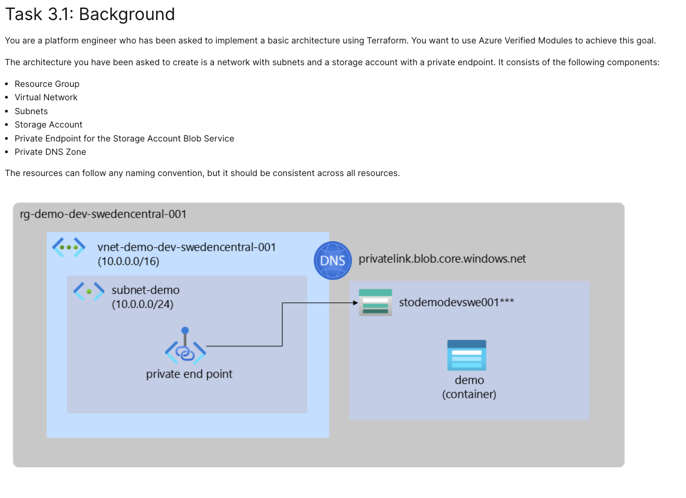

# Task 3: AVM from Scratch

## Overview

This task demonstrates building Azure infrastructure using Azure Verified Modules (AVM) from scratch. The configuration creates a complete networking and storage setup with private connectivity using Terraform.



## Architecture

This deployment provisions the following Azure resources:

- **Resource Group** - Container for all resources
- **Virtual Network** - Core networking with address space 10.0.0.0/16
- **Subnet** - Virtual network subnet with address space 10.0.0.0/24
- **Storage Account** - Azure Storage with a unique name generated dynamically
- **Private Endpoint** - Secure connection from subnet to storage account blob service
- **Private DNS Zone** - DNS resolution for private endpoints (privatelink.blob.core.windows.net)
- **Virtual Network Link** - Integration between private DNS zone and virtual network

## Files

### `main.tf`
Defines all infrastructure modules and resources:
- **avm-res-resources-resourcegroup** - Creates the resource group using AVM
- **vnet** - Deploys virtual network with AVM
- **avm-res-network-virtualnetwork_subnet** - Creates subnet within the virtual network
- **private_dns_zone** - Sets up private DNS zone for blob storage resolution
- **avm-res-storage-storageaccount** - Deploys storage account with private endpoint
- **random_string** - Generates unique suffix for storage account naming

### `variables.tf`
Input variables for the configuration:
- `location` - Azure region (default: uksouth)
- `name` - Resource group name (default: rg-demo-task3-uksouth-001)
- `tags` - Optional tags for resource management

### `terraform.tf`
Provider and version configuration:
- Terraform version: >= 1.11
- Azure Provider: ~> 4.21
- Azure AD authentication enabled for storage operations

## Prerequisites

- Terraform >= 1.11
- Azure CLI configured with appropriate credentials
- Azure subscription with permissions to create resources

## Deployment

### Initialize Terraform
```bash
terraform init
```

### Plan the deployment
```bash
terraform plan -out=tfplan
```

### Apply the configuration
```bash
terraform apply tfplan
```

## Key Features

- **Azure Verified Modules** - Uses official AVM modules for reliable, best-practice infrastructure
- **Private Connectivity** - Storage account access through private endpoints only
- **DNS Resolution** - Private DNS zone ensures proper name resolution for private endpoints
- **Unique Naming** - Random string generation ensures globally unique storage account names
- **Telemetry** - Virtual network telemetry enabled for monitoring

## Modules Used

| Module | Version | Purpose |
|--------|---------|---------|
| Azure/avm-res-resources-resourcegroup | 0.2.1 | Resource Group creation |
| Azure/avm-res-network-virtualnetwork | 0.16.0 | Virtual Network and Subnet |
| Azure/avm-res-network-privatednszone | 0.4.0 | Private DNS Zone |
| Azure/avm-res-storage-storageaccount | 0.6.7 | Storage Account with Private Endpoint |

## Outputs

Run `terraform output` to view outputs (if defined in outputs.tf).

## Cleanup

To destroy all resources:
```bash
terraform destroy
```

## Notes

- Storage account names must be globally unique; this configuration generates a unique suffix automatically
- Private endpoints require the subnet to be in the same virtual network and region
- Private DNS zone enables automatic DNS resolution for the private endpoint
