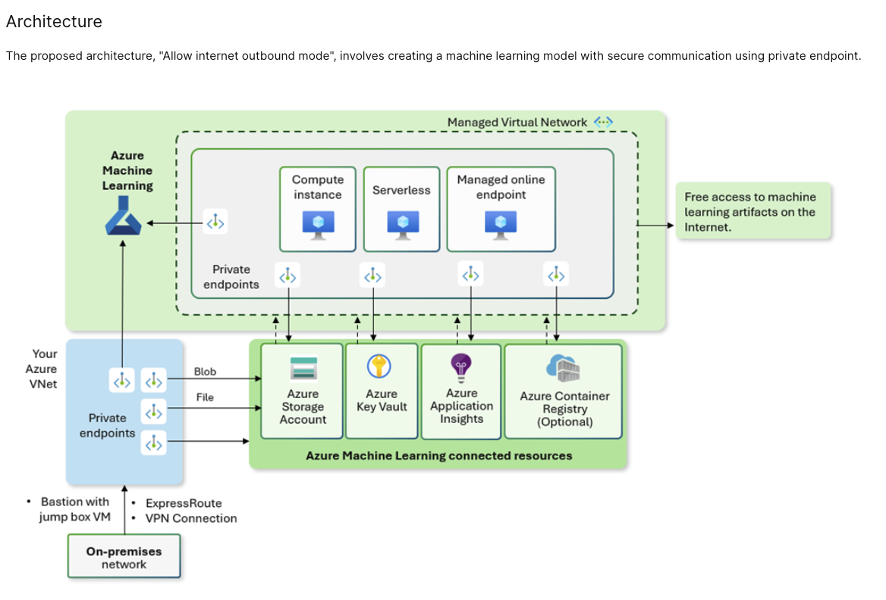

# Task 4: Azure AI with Machine Learning

## Overview

This task demonstrates building a complete Azure Machine Learning infrastructure with enterprise-grade security and networking. The configuration creates an integrated environment with a virtual machine, bastion host, key vault, storage, and an Azure Machine Learning workspace using Azure Verified Modules (AVM).



## Architecture

This deployment provisions a comprehensive AI/ML infrastructure with the following components:

### Compute & Networking
- **Resource Group** - Container for all resources (randomly placed region)
- **Virtual Network** - Core networking with address space 192.168.0.0/16
- **Compute Subnet** - For VM deployment (192.168.0.0/24)
- **Bastion Subnet** - Dedicated Azure Bastion host access (192.168.1.0/24)
- **PE Subnet** - Private endpoints subnet (192.168.2.0/24)
- **Private Endpoints Subnet** - Additional private connectivity (192.168.3.0/24)
- **Azure Bastion** - Secure RDP/SSH access to private VMs
- **Public IP** - Static IP for Bastion host

### Compute
- **Virtual Machine** - Linux-based compute instance (Standard_DC1ds_v3 in Zone 3)
- **Network Interface** - Private NIC with no public IP

### Security & Storage
- **User-Assigned Managed Identity** - For Azure resource authentication
- **Key Vault** - Secrets and certificate management with network ACLs
- **Storage Account** - LRS storage with shared access key disabled
- **Log Analytics Workspace** - Monitoring and diagnostics

### ML Infrastructure
- **Application Insights** - Application monitoring and analytics
- **Azure Machine Learning Workspace** - ML experiment, training, and deployment platform

## Files

### `main.tf`
Core infrastructure and Azure Machine Learning workspace:
- **naming module** - Generates Azure-compliant resource names
- **regions module** - Random region selection for deployment
- **resource group** - Container for all resources
- **user-assigned identity** - For managed authentication
- **machine learning workspace** - Primary ML training and deployment resource

### `vnet.tf`
Virtual networking configuration:
- **Virtual Network** - 192.168.0.0/16 address space with DNS and encryption
- **Compute Subnet** - 192.168.0.0/24 for VM deployment
- **Bastion Subnet** - 192.168.1.0/24 for secure access
- **PE Subnet** - 192.168.2.0/24 for private endpoints
- **Private Endpoints Subnet** - 192.168.3.0/24 for additional connectivity
- Role assignments and VM protection enabled

### `vm.tf`
Virtual machine configuration:
- **Linux VM** - Ubuntu 20.04 LTS with Standard_DC1ds_v3 SKU (Zone 3)
- **Network Interface** - Private IP only (access via Bastion)
- **Key Vault Integration** - Auto-generated secrets stored in vault
- Environment-tagged resources

### `bastion.tf`
Secure remote access:
- **Azure Bastion** - Standard SKU for RDP/SSH over HTTPS
- **Public IP** - Static allocation for bastion connectivity

### `keyvault.tf`
Secrets management:
- **Key Vault** - Standard tier with network ACLs
- **Network Rules** - IP-based access control (bypass: AzureServices)
- **Access Policies** - Legacy policies for secret management
- **Role Assignments** - Managed identity contributor access

### `storage.tf`
Data storage:
- **Storage Account** - Standard LRS with disabled shared access keys
- **Account Tier** - Standard with LRS replication
- **Role Assignments** - User-assigned identity as contributor

### `app-insights.tf`
Monitoring infrastructure:
- **Application Insights** - Application performance monitoring
- **Log Analytics Workspace** - PerGB2018 pricing tier for diagnostic logs

### `locals.tf`
Configuration variables and naming:
- Resource naming conventions
- Subnet naming and CIDR assignments
- Location settings (East US)
- Machine Learning workspace name
- Hash-based key vault and storage account naming

### `variables.tf`
Input variables:
- `enable_telemetry` - Toggle AVM telemetry (default: true)
- `subscription_id` - Target Azure subscription

### `terraform.tf`
Provider and version configuration:
- Terraform version: >= 1.9, < 2.0
- Azure Provider: >= 3.74.0, ~> 4.0
- Azure AD authentication for storage operations

## Prerequisites

- Terraform 1.9 or later (< 2.0)
- Azure CLI configured with authentication
- Azure subscription with sufficient permissions
- Target IP address for Key Vault network ACLs (see `keyvault.tf`)

## Deployment

### Initialize Terraform
```bash
cd task4_AzureAI_with_ML
terraform init
```

### Plan the deployment
```bash
terraform plan -out=tfplan
```

### Apply the configuration
```bash
terraform apply tfplan
```

## Key Features

### Enterprise Security
- **Network Isolation** - Private subnets with restricted outbound access
- **Key Vault Protection** - Network-controlled access with IP-based rules
- **Managed Identity** - No credential storage, token-based authentication
- **Bastion Access** - Secure RDP/SSH without public IPs

### Networking
- **Multiple Subnets** - Segregated compute, bastion, and PE subnets
- **Flow Timeout** - 30-minute timeout for network flows
- **DNS Configuration** - Custom DNS servers (8.8.8.8)
- **VM Protection** - Enabled for advanced security

### Machine Learning
- **Integrated Workspace** - Connected to storage, key vault, and app insights
- **Application Insights** - Real-time monitoring of ML operations
- **Shared Services** - Storage and key vault for data and secrets

## Modules Used

| Module | Version | Purpose |
|--------|---------|---------|
| Azure/naming | >= 0.3.0 | Resource naming conventions |
| Azure/regions | >= 0.3.0 | Azure region information |
| Azure/avm-res-network-virtualnetwork | 0.16.0 | Virtual network and subnets |
| Azure/avm-res-storage-storageaccount | Latest | Storage account management |
| Azure/avm-res-keyvault-vault | Latest | Key vault and access policies |
| Azure/avm-res-insights-component | Latest | Application Insights |
| Azure/avm-res-compute-virtualmachine | Latest | Virtual machine deployment |

## Accessing the Virtual Machine

1. **Via Azure Bastion**:
   ```bash
   az network bastion ssh --resource-group <rg-name> --name bastion --target-resource-id <vm-resource-id>
   ```

2. **Or use Azure Portal**:
   - Navigate to the VM resource
   - Click "Connect" → "Bastion"
   - Authenticate and access the VM

## Outputs

Run `terraform output` to view deployment outputs (if defined in `outputs.tf`).

## Cleanup

To destroy all resources:
```bash
terraform destroy
```

## References

- [Azure Machine Learning Documentation](https://learn.microsoft.com/en-us/azure/machine-learning/)
- [Azure Bastion Overview](https://learn.microsoft.com/en-us/azure/bastion/bastion-overview)
- [Azure Verified Modules](https://azure.github.io/Azure-Verified-Modules/)
